# TriageAI / SympDirect — System Architecture

## Clinical Safety Positioning

TriageAI / SympDirect is a review-first clinical decision-support workflow for structured intake and ESI care routing. It is not a diagnostic system, does not recommend treatment, is not an AI doctor, and does not replace clinician judgment. Speech transcription, clinical NLP extraction, model output, safety escalation, and reports all remain subject to clinician review.

## End-to-End Architecture

```mermaid
flowchart LR
    subgraph client ["React frontend and clinician workflow"]
        clinicalIntake["Clinical intake"]
        browserAudio["Optional browser audio recording"]
        localPlayback["Local audio playback"]
        transcriptReview["Transcript review and edit"]
        clinicalNote["Reviewed clinical note"]
        extractionReview["Clinician review and edit of extracted fields"]
        resultView["Decision-support result"]
        clinicianDecision["Clinician accept or override"]
        reactViews["React dashboard and assessment detail views"]
    end

    subgraph gateway ["FastAPI backend and API routes"]
        speechApi["POST /speech/transcribe"]
        nlpApi["POST /nlp/extract-intake"]
        predictApi["POST /predict"]
        reviewApi["POST /clinician-review"]
        reportApi["POST /reports/generate"]
        readApi["Assessment, dashboard, audit, and report APIs"]
    end

    subgraph service ["Backend decision-support services"]
        speechService["Temporary-file speech service"]
        nlpLayer["Clinical NLP safety layer"]
        preModelRules["Pre-model safety rules and input checks"]
        featureBuilder["Validated feature builder"]
        modelService["LightGBM V2 ESI 3/4/5 model"]
        postModelRules["Post-model safety escalation"]
        decisionResult["Decision-support result assembly"]
        persistenceService["Assessment and review persistence"]
        auditService["Audit logging"]
        pdfService["PDF report generation"]
    end

    subgraph datastore ["Persistence and validated artifacts"]
        modelRegistry["LightGBM V2 model registry"]
        clinicalDatabase["SQLite local or PostgreSQL deployment database"]
        auditTrail["Audit trail records"]
        pdfFiles["Generated PDF report files"]
    end

    subgraph external ["Optional external integration"]
        azureSpeech["Azure Speech-to-Text"]
    end

    clinicalIntake -->|"Optional recording"| browserAudio
    browserAudio --> localPlayback
    browserAudio -->|"Explicit multipart upload"| speechApi
    speechApi --> speechService
    speechService -.->|"Azure Speech: transcribes audio"| azureSpeech
    speechService -->|"Review-required transcript"| transcriptReview
    clinicalIntake -->|"Manual note or transcript"| transcriptReview
    transcriptReview --> clinicalNote
    clinicalNote -->|"Explicit extraction action"| nlpApi
    nlpApi --> nlpLayer
    nlpLayer -->|"Fields, evidence, cues, and missing data"| extractionReview
    clinicalIntake -->|"Structured fields"| extractionReview
    extractionReview -->|"Reviewed intake only"| predictApi
    predictApi --> preModelRules
    preModelRules --> featureBuilder
    featureBuilder --> modelService
    modelRegistry -->|"Loads validated artifacts"| modelService
    modelService --> postModelRules
    postModelRules --> decisionResult
    decisionResult --> resultView
    decisionResult --> persistenceService
    resultView --> clinicianDecision
    clinicianDecision --> reviewApi
    reviewApi --> persistenceService
    persistenceService --> clinicalDatabase
    persistenceService --> auditService
    auditService --> auditTrail
    clinicianDecision -->|"Explicit report action"| reportApi
    reportApi --> pdfService
    clinicalDatabase --> pdfService
    auditTrail --> pdfService
    pdfService --> pdfFiles
    clinicalDatabase --> readApi
    auditTrail --> readApi
    pdfFiles --> readApi
    readApi --> reactViews
```



The diagram shows deliberate review gates rather than automatic chaining. Recording audio does not trigger transcription; transcription does not trigger NLP extraction; NLP extraction does not trigger prediction; and the decision-support result does not replace clinician acceptance or override.

## React Frontend

The React + Vite application provides structured intake, optional browser recording and local playback, editable transcript and NLP-review panels, assessment detail, dashboard, audit, and report views. API calls are explicit user actions. Real assessment state is loaded from FastAPI; browser storage is not the clinical source of truth.

## FastAPI Backend

FastAPI owns request validation, speech and NLP routes, feature preparation, model execution, safety-rule handling, persistence, review actions, audit access, and PDF generation. Typed schemas keep the frontend contract stable, including review-required and decision-support disclaimers.

## Speech-to-Text Workflow

The browser keeps recorded audio in memory for local playback until the clinician explicitly selects **Transcribe recording**. The frontend sends the audio only to `POST /speech/transcribe` as multipart form data. The backend uses a temporary file for the optional Azure Speech-to-Text call, deletes that file after processing, and does not store raw audio in the database.

Azure credentials remain backend-only in `AZURE_SPEECH_KEY` and `AZURE_SPEECH_REGION`. When Azure is not configured, the endpoint returns a safe structured placeholder response and leaves manual transcript entry available. A returned transcript remains editable and must be reviewed before it can be copied into the clinical note.

## Clinical NLP Safety Layer

`POST /nlp/extract-intake` converts a clinician-submitted note into reviewable fields, evidence snippets, configured safety cues, and missing-field indicators. It does not diagnose or assign a final ESI level. Extraction runs only after an explicit action, and reviewed fields remain editable before prediction.

## LightGBM Model Registry

The backend model loader reads the validated LightGBM V2 artifacts from `model_registry/esi_345_lightgbm_v2/`. The classifier scope is ESI 3, 4, and 5. Feature schema, preprocessing artifacts, class mapping, threshold configuration, model metadata, and the trained model are loaded through the registry rather than owned by the frontend.

## Safety Rules

Pre-model checks enforce structured-input and review boundaries before inference. Transparent safety signals are carried into the decision path. After the model returns an ESI 3/4/5 result, post-model rules can escalate the routing output when configured high-risk conditions are present. These rules are review safeguards, not diagnoses, and the clinician remains responsible for the final decision.

## Database and Audit Trail

SQLAlchemy persists patients, assessments, predictions, clinician reviews, audit logs, and report metadata. SQLite supports the local demonstration workflow; PostgreSQL is the recommended production database. Reviewed NLP metadata, clinician accept/override actions, override reasons, and report events are audit-visible. Raw recorded audio is not persisted.

## PDF Reporting

The FastAPI ReportLab service generates decision-support PDFs from stored assessment, prediction, safety-rule, clinician-review, and optional audit data. Reports include clinical safety language and are generated or downloaded through backend endpoints. Generated PDF files are runtime artifacts and are not committed to source control.

## Docker Local Run

Docker Compose starts the React frontend and FastAPI backend for local full-stack review, with named volumes for the SQLite demo database and generated reports.

```bash
docker compose up --build
```

The default local endpoints are `http://localhost:5173` for React and `http://localhost:8001` for FastAPI.

## Deployment Readiness

GitHub Actions runs backend tests plus frontend tests and build checks. The repository includes a [deployment readiness plan](../deployment/deployment_readiness_plan.md), but local readiness is not equivalent to approval for live clinical use. A professional deployment still requires managed secrets, PostgreSQL, durable report storage, TLS, monitoring, backup and recovery, authentication and role hardening, privacy and security review, clinical validation, regulatory assessment, and organizational governance.
